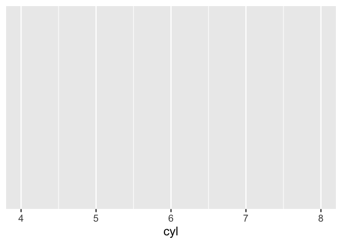
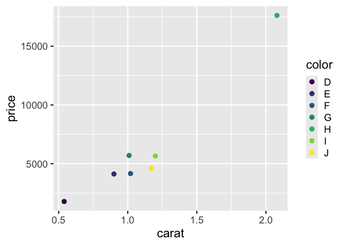
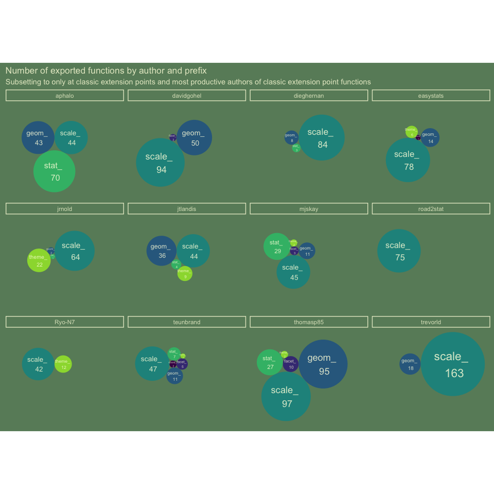
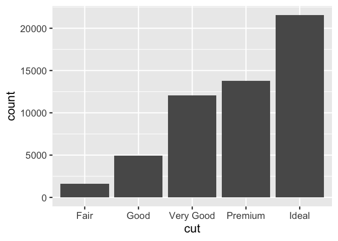
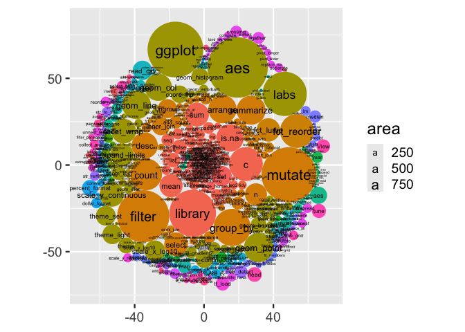

- [build functionality using the ggplot_add extension
  mechanism…](#build-functionality-using-the-ggplot_add-extension-mechanism)
  - [data_replace()](#data_replace)
  - [data_filter()](#data_filter)
  - [data_slice()](#data_slice)
  - [data_slice_max()](#data_slice_max)
  - [data_slice_top_summarized](#data_slice_top_summarized)
  - [data_slice_sample()](#data_slice_sample)
  - [data_arrange()](#data_arrange)
  - [data_mutate()](#data_mutate)
  - [data_split_unnest()](#data_split_unnest)
  - [last_plot_data()](#last_plot_data)
  - [data_nest](#data_nest)
    - [intercept()](#intercept)
  - [Experiment…](#experiment)
- [facet_across](#facet_across)
- [explore extension exported
  functions…](#explore-extension-exported-functions)
- [{ggwipe}: print the last plot and remove stat/geom/annotate layers in
  one
  step](#ggwipe-print-the-last-plot-and-remove-statgeomannotate-layers-in-one-step)
  - [You can specify the specific layer, with the `index = n`
    argument](#you-can-specify-the-specific-layer-with-the-index--n-argument)
  - [You can also use it for backtracking - removing the most recent
    layer with
    `last_plot_wipe_last()`.](#you-can-also-use-it-for-backtracking---removing-the-most-recent-layer-with-last_plot_wipe_last)
- [Curious about implementation? Details about building these
  functions](#curious-about-implementation-details-about-building-these-functions)
- [Step 0. Status quo, ‘plot’ w/ no layers, or manually removing
  layers](#step-0-status-quo-plot-w-no-layers-or-manually-removing-layers)
- [Step 0.b removing a specific
  layer.](#step-0b-removing-a-specific-layer)
- [put it in a function:
  `last_plot_wipe`](#put-it-in-a-function-last_plot_wipe)
  - [Try it out.](#try-it-out)
- [A convenience function,
  last_plot_wipe_last](#a-convenience-function-last_plot_wipe_last)
  - [Try it](#try-it)
- [Other work](#other-work)
- [Part 2. Packaging and documentation 🚧
  ✅](#part-2-packaging-and-documentation--)
  - [minimal requirements for github package. Have
    you:](#minimal-requirements-for-github-package-have-you)
    - [Created files for package archetecture with
      `devtools::create("./ggbarlabs")`
      ✅](#created-files-for-package-archetecture-with-devtoolscreateggbarlabs-)
    - [Moved functions R folder? ✅](#moved-functions-r-folder-)
    - [Added roxygen skeleton? ✅](#added-roxygen-skeleton-)
    - [Managed dependencies ? ✅](#managed-dependencies--)

<!-- README.md is generated from README.Rmd. Please edit that file -->

# build functionality using the ggplot_add extension mechanism…

<https://evamaerey.github.io/mytidytuesday/2024-07-10-ggnewdata/ggnewdata.html>

``` r
layers_wipe <- function(i = NULL) {

  structure(
    list(wipe_which = i), 
    class = "layers_wipe"
    )

}


ggplot_add.layers_wipe <- function(object, plot, object_name) {
  
  if(is.null(object$wipe_which)){
   
    plot$layers <- list()
     
  }else{
    
  plot$layers[object$wipe_which] <- NULL

  }
  
  plot
  
}
```

``` r
ggplot(mtcars) + 
  aes(x = cyl) + 
  geom_bar() + 
  stat_count(geom = "point")
```

<!-- -->

``` r

last_plot() + 
  layers_wipe(i = 1)
```

<!-- -->

``` r

last_plot() + 
  layers_wipe()
```

<!-- -->

### data_replace()

``` r
#' @export
data_replace <- function(data = NULL) {

  structure(
    list(new_data_specification = data), 
    class = "df_replace"
    )

}

#' @export

ggplot_add.df_replace <- function(object, plot, object_name) {
  
  plot$data <- object$new_data_specification
  plot

}
```

``` r
ggplot(mtcars) + 
  aes(cyl) + 
  geom_bar()
```

<!-- -->

``` r

last_plot() + 
  data_replace(data = mpg)
```

<!-- -->

### data_filter()

``` r
#' @export
#' 
library(ggplot2)
data_filter <- function(.keep, .by) {
  structure(list(keep_specification = rlang::enquo(.keep), 
                 by_specification = rlang::enquo(.by)), 
            class = "filterobs")
}

#' @export
ggplot_add.filterobs <- function(object, plot, object_name) {
  
  plot$unfiltered_data <- plot$unfiltered_data %||% plot$data
  
  new_data <- dplyr::filter(plot$data, 
                            !!object$keep_specification, 
                            .by = !!object$by_specification)
  plot$data <- new_data
  plot

}

data_unfilter <- function(){
    structure(list(), 
            class = "unfilterobs")
  
}


#' @export
ggplot_add.unfilterobs <- function(object, plot, object_name) {
  
  plot$data <- plot$unfiltered_data %||% plot$data
  
  plot

}
```

``` r
library(ggplot2)

ggplot(mtcars) + 
  aes(wt) +
  geom_density() +
  aes(color = factor(cyl))
```

<!-- -->

``` r

last_plot() +
  data_filter(cyl != 4)
```

<!-- -->

``` r

last_plot() + 
  data_unfilter()
```

<!-- -->

``` r
drob_funs <- readr::read_csv('https://raw.githubusercontent.com/rfordatascience/tidytuesday/master/data/2024/2024-07-09/drob_funs.csv')

drob_funs %>% 
  ggplot() + 
  aes(y = funs) + 
  aes(y = fct_infreq(funs)) +
  aes(y = fct_infreq(funs) %>% fct_rev()) +
  geom_bar() 
```

<!-- -->

``` r

last_plot() + 
  data_filter(n() >= 500, 
              .by = c(funs, pkgs)) +
  labs(title = "Functions used 500 or more times by @drob")
```

<!-- -->

``` r


last_plot() + 
  data_filter(pkgs == "ggplot") + 
  labs(title = "ggplot2 functions used 500 or more times by @drob")
```

<!-- -->

### data_slice()

``` r
#' @export
data_slice <- function(keep, .by) {
  
  structure(list(keep_specification = rlang::enquo(keep), 
                 by_specification = rlang::enquo(.by)), 
            class = "slice_obs")
  
}

#' @export
ggplot_add.slice_obs <- function(object, plot, object_name, .by) {
  
  new_data <- dplyr::slice(plot$data, 
                           !! object$keep_specification, 
                           .by = !! object$by_specification)
  plot$data <- new_data
  plot

  }
```

``` r
library(ggplot2)
ggplot(mtcars) + 
  aes(wt, mpg) + 
  geom_point() + 
  data_slice(1:5, .by = cyl) + 
  aes(color = factor(cyl))
```

<!-- -->

### data_slice_max()

``` r
#' @export
data_slice_max <- function(ordered_by, n = 10, by) {
  
  structure(list(ordered_by_specification = rlang::enquo(ordered_by),
                 n_specification = n, 
                 by_specification = rlang::enquo(by)),
            class = "slice_max_obs")
  
}

#' @export
ggplot_add.slice_max_obs <- function(object, plot, object_name) {
  
  new_data <- dplyr::slice_max(plot$data, 
                               order_by = !! object$ordered_by_specification, 
                               n = object$n_specification, 
                               by = !! object$by_specification)
  plot$data <- new_data
  plot

  }
```

``` r
ggplot(gapminder::gapminder %>% filter(year == 2002)) + 
  aes(pop, interaction(country, rank(pop))) + 
  geom_col() 
```

<!-- -->

``` r

last_plot() + 
  data_slice_max(pop)
```

<!-- -->

``` r

last_plot() + 
  data_slice_max(pop, n = 3)
```

<!-- -->

``` r


# ggplot(diamonds) + 
#   aes(y = cut) + 
#   geom_bar() + 
#   data_slice_max(n = 3)
```

## data_slice_top_summarized

``` r

gapminder::gapminder |> 
    mutate(agg = sum(pop), .by = country) |> 
    arrange(-agg) |>
    mutate(therank = rank(agg)) |>
    filter(therank < 10)
#> # A tibble: 12 × 8
#>    country               continent  year lifeExp    pop gdpPercap    agg therank
#>    <fct>                 <fct>     <int>   <dbl>  <int>     <dbl>  <dbl>   <dbl>
#>  1 Sao Tome and Principe Africa     1952    46.5  60011      880. 1.27e6     6.5
#>  2 Sao Tome and Principe Africa     1957    48.9  61325      861. 1.27e6     6.5
#>  3 Sao Tome and Principe Africa     1962    51.9  65345     1072. 1.27e6     6.5
#>  4 Sao Tome and Principe Africa     1967    54.4  70787     1385. 1.27e6     6.5
#>  5 Sao Tome and Principe Africa     1972    56.5  76595     1533. 1.27e6     6.5
#>  6 Sao Tome and Principe Africa     1977    58.6  86796     1738. 1.27e6     6.5
#>  7 Sao Tome and Principe Africa     1982    60.4  98593     1890. 1.27e6     6.5
#>  8 Sao Tome and Principe Africa     1987    61.7 110812     1517. 1.27e6     6.5
#>  9 Sao Tome and Principe Africa     1992    62.7 125911     1429. 1.27e6     6.5
#> 10 Sao Tome and Principe Africa     1997    63.3 145608     1339. 1.27e6     6.5
#> 11 Sao Tome and Principe Africa     2002    64.3 170372     1353. 1.27e6     6.5
#> 12 Sao Tome and Principe Africa     2007    65.5 199579     1598. 1.27e6     6.5

slice_top_summarized <- function(data, .by, value = NULL, n = 10, fun = sum){
  
    value_quo <- rlang::enquo(value)

      if(rlang::quo_is_null(value_quo) ){

      ## adding a value as 1 if there is none
      data <- data |>
        dplyr::mutate(value = 1)
      
    }else{
      
      data <- data |> 
          dplyr::mutate(value = {{value}})
        
    }  
    
  data |>
    summarise(agg = fun(.data$value), .by = {{.by}}) |> 
    ungroup() |>
    arrange(-agg) |> 
    slice(1:n) |> 
    select(-agg) |>
    left_join(data)
  
}


gapminder::gapminder |> 
  slice_top_summarized(country, pop, n = 3) |>
  ggplot() + 
  aes(year, pop, group = country) + 
  geom_line()
```

<!-- -->

``` r


tidytitanic::tidy_titanic |> 
  # mutate(value = 1) |>
  slice_top_summarized(class, n = 4) |>
  ggplot() + 
  aes(y = class) + 
  geom_bar()
```

<!-- -->

``` r


#' @export
data_slice_top_summarized <- function(.by, value = NULL,  n = 10, fun = sum) {
  
  structure(list(value_specification = rlang::enquo(value),
                 by_specification = rlang::enquo(.by),
                 ###########
                 n_specification = n, 
                 fun_specification = fun),
            class = "data_slice_top_summarized")
  
}

#' @export
ggplot_add.data_slice_top_summarized <- function(object, plot, object_name) {
  
  plot$unfiltered_data <- plot$unfiltered_data %||% plot$data

  
  new_data <- slice_top_summarized(plot$data, 
                               value = !! object$value_specification, 
                               .by = !! object$by_specification,
                               #########
                               n = object$n_specification, 
                               fun = object$fun_specification
                               )
  plot$data <- new_data
  plot

  }

tidytitanic::tidy_titanic |> 
  ggplot() + 
  aes(y = class) + 
  geom_bar() + 
  data_slice_top_summarized(class, n = 2)
```

<!-- -->

``` r

gapminder::gapminder |> 
  ggplot() + 
  aes(year, pop, group = country) + 
  geom_line() +
  data_slice_top_summarized(country, pop, n = 5, fun = mean)
```

<!-- -->

## data_slice_sample()

``` r
#' @export
data_slice_sample <- function(n = 10, by) {
  
  structure(list(n_specification = n, 
                 by_specification = rlang::enquo(by)),
                 class = "slice_sample_obs")
  
}

ggplot_add.slice_sample_obs <- function(object, plot, object_name) {
  
  new_data <- dplyr::slice_sample(plot$data, 
                               n = object$n_specification, 
                               by = !! object$by_specification)
  plot$data <- new_data
  plot

  }
```

``` r
ggplot(diamonds) + 
  aes(carat, price) + 
  geom_point() + 
  data_slice_sample(n = 300)
```

<!-- -->

``` r

last_plot() + 
  data_slice_sample(n = 1, by = color) +
  aes(color = color)
```

<!-- -->

## data_arrange()

``` r
#' @export
data_arrange <- function(arrange) {
  structure(list(arrange_specification = rlang::enquo(arrange)), 
            class = "arrange_obs")
}

ggplot_add.arrange_obs <- function(object, plot, object_name) {
  
  new_data <- dplyr::arrange(plot$data, 
                            !! object$arrange_specification)
  plot$data <- new_data
  plot

}
```

``` r
library(ggplot2)
ggplot(mtcars) + 
  aes(wt, mpg) + 
  geom_point() + 
  aes(color = fct_inorder(factor(cyl))) 
```

<!-- -->

``` r

last_plot() +
  data_arrange(- cyl)
```

<!-- -->

## data_mutate()

``` r
#' @export
data_mutate <- function(.value, .by, var_name) {
  structure(list(value_specification = rlang::enquo(.value),
                 by_specification = rlang::enquo(.by),
                 var_name_specification = var_name),
            class = "data_mutate")
  
}

ggplot_add.data_mutate <- function(object, plot, object_name) {

  
  new_data <- dplyr::mutate(plot$data, 
                            .value = !! object$value_specification, 
                            .by = !! object$by_specification)
  
    message("New variable named '.value' created")
    

    if(object$var_name %in% names(new_data)){
      
      new_data[,object$var_name] <- new_data$.value
      
      new_data <- new_data %>% select(-.value)
    }else{
    names(new_data)[names(new_data) == ".value"] <- object$var_name
    }
    
    
  plot$data <- new_data
  plot

}
```

``` r
library(ggplot2)
ggplot(mtcars) + 
  aes(wt, mpg) + 
  geom_point() + 
  data_mutate(var = "wt_times_mpg", wt*mpg) + 
  aes(color = wt_times_mpg)
```

<!-- -->

## data_split_unnest()

``` r
data_split_unnest <- function(var_name, sep) {
  structure(list(var_specification = rlang::enquo(var)),
            class = "arrange_obs")
}

ggplot_add.arrange_obs <- function(object, plot, object_name) {

  new_data <- dplyr::mutate(plot$data,
                            !! object$arrange_specification)
  plot$data <- new_data
  plot

}
```

## last_plot_data()

``` r
#' @export
last_plot_data <- function(){
  
  last_plot()$data
  
}
```

``` r
last_plot_data() %>% 
  dplyr::select(mpg, cyl, wt, wt_times_mpg)
#>                      mpg cyl    wt wt_times_mpg
#> Mazda RX4           21.0   6 2.620      55.0200
#> Mazda RX4 Wag       21.0   6 2.875      60.3750
#> Datsun 710          22.8   4 2.320      52.8960
#> Hornet 4 Drive      21.4   6 3.215      68.8010
#> Hornet Sportabout   18.7   8 3.440      64.3280
#> Valiant             18.1   6 3.460      62.6260
#> Duster 360          14.3   8 3.570      51.0510
#> Merc 240D           24.4   4 3.190      77.8360
#> Merc 230            22.8   4 3.150      71.8200
#> Merc 280            19.2   6 3.440      66.0480
#> Merc 280C           17.8   6 3.440      61.2320
#> Merc 450SE          16.4   8 4.070      66.7480
#> Merc 450SL          17.3   8 3.730      64.5290
#> Merc 450SLC         15.2   8 3.780      57.4560
#> Cadillac Fleetwood  10.4   8 5.250      54.6000
#> Lincoln Continental 10.4   8 5.424      56.4096
#> Chrysler Imperial   14.7   8 5.345      78.5715
#> Fiat 128            32.4   4 2.200      71.2800
#> Honda Civic         30.4   4 1.615      49.0960
#> Toyota Corolla      33.9   4 1.835      62.2065
#> Toyota Corona       21.5   4 2.465      52.9975
#> Dodge Challenger    15.5   8 3.520      54.5600
#> AMC Javelin         15.2   8 3.435      52.2120
#> Camaro Z28          13.3   8 3.840      51.0720
#> Pontiac Firebird    19.2   8 3.845      73.8240
#> Fiat X1-9           27.3   4 1.935      52.8255
#> Porsche 914-2       26.0   4 2.140      55.6400
#> Lotus Europa        30.4   4 1.513      45.9952
#> Ford Pantera L      15.8   8 3.170      50.0860
#> Ferrari Dino        19.7   6 2.770      54.5690
#> Maserati Bora       15.0   8 3.570      53.5500
#> Volvo 142E          21.4   4 2.780      59.4920
```

## data_nest

``` r
#' @export
data_nest <- function(.by) {
  structure(list(by_specification = rlang::enquo(.by)),
            class = "data_nestvar")
  
}

ggplot_add.data_nestvar <- function(object, plot, object_name) {

  
  new_data <- tidyr::nest(plot$data, 
                          .by = !! object$by_specification)
    
  plot$data <- new_data
  plot

}


#' @export
data_unnest <- function() {
  structure(list(),
            class = "data_unnestvar")
  
}

ggplot_add.data_unnestvar <- function(object, plot, object_name) {

  
  new_data <- tidyr::unnest(plot$data, cols = "data")
    
  plot$data <- new_data
  
  plot

}

diamonds |>
  tidyr::nest(.by = cut) |>
  tidyr::unnest(cols = data)
#> # A tibble: 53,940 × 10
#>    cut   carat color clarity depth table price     x     y     z
#>    <ord> <dbl> <ord> <ord>   <dbl> <dbl> <int> <dbl> <dbl> <dbl>
#>  1 Ideal  0.23 E     SI2      61.5    55   326  3.95  3.98  2.43
#>  2 Ideal  0.23 J     VS1      62.8    56   340  3.93  3.9   2.46
#>  3 Ideal  0.31 J     SI2      62.2    54   344  4.35  4.37  2.71
#>  4 Ideal  0.3  I     SI2      62      54   348  4.31  4.34  2.68
#>  5 Ideal  0.33 I     SI2      61.8    55   403  4.49  4.51  2.78
#>  6 Ideal  0.33 I     SI2      61.2    56   403  4.49  4.5   2.75
#>  7 Ideal  0.33 J     SI1      61.1    56   403  4.49  4.55  2.76
#>  8 Ideal  0.23 G     VS1      61.9    54   404  3.93  3.95  2.44
#>  9 Ideal  0.32 I     SI1      60.9    55   404  4.45  4.48  2.72
#> 10 Ideal  0.3  I     SI2      61      59   405  4.3   4.33  2.63
#> # ℹ 53,930 more rows

library(ggplot2)
diamonds |>
  ggplot() + 
  aes(x = cut) + 
  geom_bar()
```

<!-- -->

``` r

last_plot() + 
  data_nest(.by = cut)
```

<!-- -->

``` r

last_plot() + 
  data_unnest()
```

<!-- -->

``` r

last_plot_data()
#> # A tibble: 53,940 × 10
#>    cut   carat color clarity depth table price     x     y     z
#>    <ord> <dbl> <ord> <ord>   <dbl> <dbl> <int> <dbl> <dbl> <dbl>
#>  1 Ideal  0.23 E     SI2      61.5    55   326  3.95  3.98  2.43
#>  2 Ideal  0.23 J     VS1      62.8    56   340  3.93  3.9   2.46
#>  3 Ideal  0.31 J     SI2      62.2    54   344  4.35  4.37  2.71
#>  4 Ideal  0.3  I     SI2      62      54   348  4.31  4.34  2.68
#>  5 Ideal  0.33 I     SI2      61.8    55   403  4.49  4.51  2.78
#>  6 Ideal  0.33 I     SI2      61.2    56   403  4.49  4.5   2.75
#>  7 Ideal  0.33 J     SI1      61.1    56   403  4.49  4.55  2.76
#>  8 Ideal  0.23 G     VS1      61.9    54   404  3.93  3.95  2.44
#>  9 Ideal  0.32 I     SI1      60.9    55   404  4.45  4.48  2.72
#> 10 Ideal  0.3  I     SI2      61      59   405  4.3   4.33  2.63
#> # ℹ 53,930 more rows
```

### intercept()

``` r
#' @export
#' 
library(ggplot2)
intercept <- function(plot_name = NULL) {

  structure(
    list(plot_name_specification = plot_name), 
    class = "intercept"
    )

}

ggplot_add.intercept <- function(object, plot, object_name) {
  
  assign(x = object$plot_name_specification, 
         value = plot, envir = .GlobalEnv)
  plot

  }
```

``` r
p3 <- ggplot(cars) + intercept("p0") +
  aes(speed, dist) + intercept("p1") +
  geom_point()

library(patchwork)
p0 + p1 + p3
```

<!-- -->

------------------------------------------------------------------------

``` r
library(tidyverse)
ggplot(cars) + 
  aes(dist, speed) + 
  geom_point(size = 7) + 
  aes(color = speed) + 
  scale_color_viridis_c(limits = c(0,26)) + 
  scale_x_continuous(limits = c(0,125)) +
  scale_y_continuous(limits = c(0,25))
```

<!-- -->

``` r
last_plot() + 
  data_filter(dist > 60)

tidytitanic::tidy_titanic |>
  ggplot() + 
  aes(x = sex) + 
  geom_bar()

last_plot() + 
  data_filter(n() > 500, .by = sex)

last_plot() + 
  aes(fill = age) 

last_plot() + 
  data_filter(n() > 1000, .by = age)
```

``` r

drob_funs %>% 
  ggplot() + 
  aes(id = paste(pkgs, funs)) + 
  ggcirclepack::geom_circlepack() + 
  ggcirclepack::geom_circlepack_text(aes(label = funs)) + 
  coord_equal() +
  aes(fill = pkgs) + 
  guides(fill = "none")
```

<!-- -->

``` r

last_plot() +
  data_mutate(.value = n(), 
              .by = c(funs, pkgs), 
              var_name = "num"
              ) 
```

<!-- -->

``` r

last_plot() +
  data_filter(num >= 200)
```

<!-- -->

``` r

last_plot() +
  data_mutate(.value = case_when(funs == "ggplot" ~ "GGPLOT",
                                     .default = funs), 
              var_name = "funs")
```

<!-- -->

``` r
data_var_update <- function(.value, .by, var_name) {
  structure(list(value_specification = rlang::enquo(.value),
                 by_specification = rlang::enquo(.by),
                 var_name_specification = var_name),
            class = "data_var_update")
  
}

ggplot_add.data_var_update <- function(object, plot, object_name) {

  
  new_data <- dplyr::mutate(plot$data, 
                            .value = !! object$value_specification, 
                            .by = !! object$by_specification)
  
  new_data[names(new_data) == object$var_name] <- new_data$.value
    
  plot$data <- new_data
  plot

  
  }
```

## Experiment…

``` r
library(tidyverse)

data_replace <- function(data = NULL) {

  structure(
    list(new_data_specification = data), 
    class = "df_replace"
    )

}

ggplot_add.df_replace <- function(object, plot, object_name) {
  
  plot$data <- object$new_data_specification
  
  if (is.function(new)) {
    new <- new(plot$data)
  }
  
  plot

  }
# 
# # define wipedata method
# ggplot_add.wipedata <- function(object, plot, object_name) {
#   new <- object$new_data_specifiction
#   # if (is.function(new)) {
#   #   new <- new(plot$data)
#   # }
#   plot$data <- new
#   plot
# }

# ggplot(mtcars) + 
#   aes(cyl) + 
#   geom_bar() + 
#   data_replace(mpg)
```

# facet_across

``` r
library(tidyverse)

gapminder::gapminder %>% 
  select(country, year, lifeExp) %>% 
  pivot_wider(names_from = year, values_from = lifeExp) ->
life_wide;

head(life_wide)
#> # A tibble: 6 × 13
#>   country  `1952` `1957` `1962` `1967` `1972` `1977` `1982` `1987` `1992` `1997`
#>   <fct>     <dbl>  <dbl>  <dbl>  <dbl>  <dbl>  <dbl>  <dbl>  <dbl>  <dbl>  <dbl>
#> 1 Afghani…   28.8   30.3   32.0   34.0   36.1   38.4   39.9   40.8   41.7   41.8
#> 2 Albania    55.2   59.3   64.8   66.2   67.7   68.9   70.4   72     71.6   73.0
#> 3 Algeria    43.1   45.7   48.3   51.4   54.5   58.0   61.4   65.8   67.7   69.2
#> 4 Angola     30.0   32.0   34     36.0   37.9   39.5   39.9   39.9   40.6   41.0
#> 5 Argenti…   62.5   64.4   65.1   65.6   67.1   68.5   69.9   70.8   71.9   73.3
#> 6 Austral…   69.1   70.3   70.9   71.1   71.9   73.5   74.7   76.3   77.6   78.8
#> # ℹ 2 more variables: `2002` <dbl>, `2007` <dbl>

life_wide %>% 
  pivot_longer(`1952`:`2007`) %>% 
ggplot() + 
  aes(x = value) + 
  geom_histogram() + 
  facet_wrap(~name)
```

<!-- -->

``` r
#' @export
facet_across <- function(x_from) {

  structure(
    list(across_specification = rlang::enquo(x_from)), 
    class = "facet_across"
    )

}

ggplot_add.facet_across <- function(object, plot, object_name, ...) {
  
  plot$data <- plot$data %>% 
    pivot_longer(!!object$across_specification, values_to = ".x")
  
  message("variables 'name' and 'value' have been created.")
  
  plot +
    facet_wrap(~name, ncol) +
       aes(!!!modifyList(aes(x = .x), plot$mapping))
  

}

mpg %>% 
  ggplot() +
  facet_across(x_from = c(cty, hwy)) + 
  geom_rug() + 
  geom_histogram()
```

``` r
life_wide %>% 
  ggplot() +
  facet_across(x_values_from = `1952`:`2007`) +
  ggxmean::geom_x_mean() + 
  geom_rug() + 
  geom_density()
```

# explore extension exported functions…

``` r
ext_exports <- read_csv("https://raw.githubusercontent.com/EvaMaeRey/mytidytuesday/refs/heads/main/2024-11-19-gg-prefixes/exported_funs_exts_ggplot2_tidyverse_org.csv") %>% 
  mutate(prefix = str_extract(fun_exported, ".*?_")) %>% 
  mutate(prefix_long = str_extract(fun_exported, ".+_")) %>% 
  mutate(ind_classic_prefix = prefix %in% c("stat_", "geom_", "theme_", "scale_", "coord_", "facet_"))


ext_exports %>% 
  ggplot() + 
  aes(id = user) + 
  ggcirclepack::geom_circlepack() + 
  ggcirclepack::geom_circlepack_text() +
  aes(label = after_stat(paste(id, "\n",area))) +
  coord_equal() + 
  theme_classic(ink = alpha("lightyellow",.8),
                paper = "darkseagreen4") + 
  theme(axis.text = element_blank()) + 
  theme(axis.line = element_blank(),
        axis.ticks = element_blank()) + 
  guides(size = "none") +
  labs(title = "Number of exported functions by author")
```

<!-- -->

``` r

last_plot() + 
  data_slice_top_summarized(user)
```

<!-- -->

``` r

(get_theme() + last_plot()$theme) |> theme_set()

last_plot() + 
  aes(id = prefix) + 
  labs(title = "Number of exported functions by function prefix")
```

<!-- -->

``` r


last_plot() + 
  data_slice_top_summarized(prefix, n = 30)
```

<!-- -->

``` r

last_plot() + 
  data_filter(ind_classic_prefix) + 
  labs(subtitle = "Subsetting to only at classic extension points")
```

<!-- -->

``` r

last_plot() + 
  aes(id = prefix_long) + 
  labs(subtitle = "Subsetting to only classic extension points - number of functions by long prefix ...")
```

<!-- -->

``` r
  
last_plot() + 
  aes(id = prefix) + 
  aes(fill = prefix) + 
  theme(legend.position = "top") + 
  theme(legend.justification = "left") +
  scale_fill_viridis_d(end = .85) + 
  labs(subtitle = "")
```

<!-- -->

``` r
  
  
last_plot() +
  aes(id = user) + 
  labs(title = "Number of exported functions by author and prefix",
       subtitle = "Subsetting to classic extension points") + 
  labs(fill = NULL) + 
  facet_wrap(~ prefix)
```

<!-- -->

``` r
last_plot() +  
  data_filter(n() > 50, .by = user) + 
  labs(subtitle = "Subsetting to only at classic extension points and most productive authors of classic extension point functions") +
  facet_wrap(~user) +
  aes(id = prefix) + 
  aes(fill = prefix) + 
  theme(legend.position = "none")
```

<!-- -->

``` r

last_plot() + 
  aes(group = paste0(repo, "::", fun_exported),
      label = "") + 
  theme(legend.position = "top")
```

<!-- -->

# {ggwipe}: print the last plot and remove stat/geom/annotate layers in one step

<!-- badges: start -->
<!-- badges: end -->

In general ggplot2 lets you work in very fluidly, including ‘undoing’
your work. For example facet_null() and aes(fill = NULL) are moves that
allow you to ‘undo’ your faceting and fill decisions.

However, when it comes to layers, ggplot2 itself does not allow you to
remove stat/geom/annotation layers dynamically.

ggwipe::last_plot_wipe() lets you remove all layers or specified layers
from the ‘last plot’.

There are other approaches to this problem which I summarize in the ‘see
also’ section. The difference between ggwipe::last_plot_wipe() and these
approaches is that last_plot_wipe doesn’t require you to save out your
plot as an object. Instead it favors a more exploratory work flow, so
uses ggplot2::last_plot() retrieve the last plot, modifies it by
removing layers as specified, before it’s returned back to the user for
presentation or further manipulation.

``` r
library(tidyverse, warn.conflicts = F)
library(ggwipe)
mtcars %>% 
  ggplot() + 
  aes(am, fill = factor(vs)) +
  geom_bar() +
  labs(tag = "Plot 1")

last_plot_wipe() + 
  geom_bar(position = "fill") +
  labs(tag = "Plot 2")
```


``` r
mtcars %>% 
  ggplot() + 
  aes(x = am, fill = factor(vs)) +
  geom_bar() +
  labs(tag = "Plot 3")

last_plot()$layers
#> $geom_bar
#> geom_bar: just = 0.5, na.rm = FALSE, orientation = NA
#> stat_count: na.rm = FALSE, orientation = NA
#> position_stack

last_plot_wipe() + 
  aes(y = vs, fill = NULL) + 
  geom_count() +
  labs(tag = "Plot 4")

last_plot()$layers
#> $geom_count
#> geom_point: na.rm = FALSE
#> stat_sum: na.rm = FALSE
#> position_identity

last_plot_wipe() + 
  geom_count(shape = 21)
```


## You can specify the specific layer, with the `index = n` argument

``` r
ggplot(data = cars) + 
  aes(x = speed, y = dist) + 
  geom_rug() + # layer 1
  geom_point() + 
  geom_smooth()

last_plot_wipe(index = 1)  # removes rug
```


## You can also use it for backtracking - removing the most recent layer with `last_plot_wipe_last()`.

This function automatically detects the last layer.

``` r
ggplot(data = cars) + 
  aes(x = speed, y = dist) + 
  geom_rug() + 
  geom_point() + 
  geom_smooth()

last_plot_wipe_last()
last_plot_wipe_last()
last_plot_wipe_last()
```


# Curious about implementation? Details about building these functions

# Step 0. Status quo, ‘plot’ w/ no layers, or manually removing layers

``` r
base_specifiction <- mtcars %>% 
  ggplot() + 
  aes(am, fill = factor(vs) )

base_specifiction + 
  geom_bar() 
```

<!-- -->

``` r

base_specifiction +
  geom_bar(position = "fill")
```

<!-- -->

``` r

p <- mtcars %>% 
  ggplot() + 
  aes(am, fill = factor(vs) ) +
  geom_bar()

p
```

<!-- -->

``` r

p$layers
#> $geom_bar
#> geom_bar: just = 0.5, na.rm = FALSE, orientation = NA
#> stat_count: na.rm = FALSE, orientation = NA
#> position_stack

p$layers <- NULL # removes all layers specification

p$layers
#> NULL

r <- p + 
  geom_bar(position = "fill")

r$layers
#> $geom_bar
#> geom_bar: just = 0.5, na.rm = FALSE, orientation = NA
#> stat_count: na.rm = FALSE, orientation = NA
#> position_fill

r
```

<!-- -->

``` r

q <- mtcars %>% 
  ggplot() + 
  aes(am, fill = factor(vs) ) +
  geom_bar(position = "fill")

q$layers
#> $geom_bar
#> geom_bar: just = 0.5, na.rm = FALSE, orientation = NA
#> stat_count: na.rm = FALSE, orientation = NA
#> position_fill
```

# Step 0.b removing a specific layer.

``` r
p <- mtcars %>% 
  ggplot() + 
  aes(am, fill = factor(vs) ) +
  geom_bar() + 
  stat_count(geom = "point", size = 14) + 
  stat_count(geom = "label", aes(label = after_stat(count)))

p
```

<!-- -->

``` r

p$layers[[2]] <- NULL # removes second layer specification

p
```

<!-- -->

# put it in a function: `last_plot_wipe`

``` r
#' Title
#'
#' @param index 
#'
#' @return
#' @export
#'
#' @examples
last_plot_wipe <- function(index = NULL){
  
  
  p <- ggplot2::last_plot()
  
  # removes all layers specification
  if(is.null(index)){ p$layers <- NULL }else{p$layers[[index]] <- NULL}
  
  return(p)
  
}
```

## Try it out.

``` r
mtcars %>% 
  ggplot() + 
  aes(am, fill = factor(vs)) +
  geom_bar()
```

<!-- -->

``` r

last_plot_wipe() + 
  geom_bar(position = "fill")
```

<!-- -->

``` r

last_plot_wipe() + 
  geom_bar(position = "identity")
```

<!-- -->

``` r


mtcars %>% 
  ggplot() + 
  aes(am, fill = factor(vs) ) +
  geom_bar() + 
  stat_count(geom = "point", size = 14) + 
  stat_count(geom = "label", aes(label = after_stat(count)))
```

<!-- -->

``` r

last_plot_wipe(index = 2)
```

<!-- -->

# A convenience function, last_plot_wipe_last

To only wipe the final layer

``` r
#' Title
#'
#' @return
#' @export
#'
#' @examples
last_plot_wipe_last <- function(){
  
  
  p <- ggplot2::last_plot()
  
  index <- length(p$layers)
  
  # removes all layers specification
  p$layers[[index]] <- NULL
  
  return(p)
  
}
```

## Try it

``` r
mtcars %>% 
  ggplot() + 
  aes(am, fill = factor(vs) ) +
  geom_bar() + 
  stat_count(geom = "point", size = 14) + 
  stat_count(geom = "label", aes(label = after_stat(count)))
```

<!-- -->

``` r

last_plot_wipe_last()
```

<!-- -->

# Other work

I think the difference is that other work would have you save the
ggplot2 object and then manipulate it, where as ggwipe lends itself to
printing the ggplot2 object and then retrieving and printing without a
new layer in one step.

- gghost Jonathan Carroll
- pedro alpho
- Jonathan Sidi ggedit

# Part 2. Packaging and documentation 🚧 ✅

## minimal requirements for github package. Have you:

### Created files for package archetecture with `devtools::create("./ggbarlabs")` ✅

### Moved functions R folder? ✅

``` r
knitrExtra::chunk_names_get()
#>  [1] "unnamed-chunk-1"     "unnamed-chunk-2"     "unnamed-chunk-3"    
#>  [4] "data_replace"        "unnamed-chunk-4"     "data_filter"        
#>  [7] "unnamed-chunk-5"     "unnamed-chunk-6"     "data_slice"         
#> [10] "unnamed-chunk-7"     "data_slice_max"      "unnamed-chunk-8"    
#> [13] "unnamed-chunk-9"     "data_slice_sample"   "unnamed-chunk-10"   
#> [16] "data_arrange"        "unnamed-chunk-11"    "unnamed-chunk-12"   
#> [19] "unnamed-chunk-13"    "unnamed-chunk-14"    "last_plot_data"     
#> [22] "unnamed-chunk-15"    "unnamed-chunk-16"    "intercept"          
#> [25] "unnamed-chunk-17"    "unnamed-chunk-18"    "unnamed-chunk-19"   
#> [28] "unnamed-chunk-20"    "unnamed-chunk-21"    "unnamed-chunk-22"   
#> [31] "unnamed-chunk-23"    "facet_across"        "unnamed-chunk-24"   
#> [34] "unnamed-chunk-25"    "unnamed-chunk-26"    "unnamed-chunk-27"   
#> [37] "unnamed-chunk-28"    "unnamed-chunk-29"    "unnamed-chunk-30"   
#> [40] "unnamed-chunk-31"    "unnamed-chunk-32"    "last_plot_wipe"     
#> [43] "unnamed-chunk-33"    "last_plot_wipe_last" "unnamed-chunk-34"   
#> [46] "unnamed-chunk-35"    "unnamed-chunk-36"    "unnamed-chunk-37"   
#> [49] "unnamed-chunk-38"    "unnamed-chunk-39"
```

``` r
knitrExtra:::chunk_to_r(c("last_plot_wipe", 
                         "last_plot_wipe_last",
                         "data_replace",
                         "data_filter",
                         "data_slice",
                         "data_slice_max",
                         "data_slice_sample",
                         "data_arrange",
                         "data_slice_sample",
                         "last_plot_data",
                         "intercept"))
```

### Added roxygen skeleton? ✅

for auto documentation and making sure proposed functions are *exported*

### Managed dependencies ? ✅

package dependancies managed, i.e. `depend::function()` in proposed
functions and declared in the DESCRIPTION

``` r
usethis::use_package("ggplot2")
usethis::use_package("dplyr")
```

``` r
devtools::document()
devtools::check()
devtools::install(pkg = ".", upgrade = "never")
```
